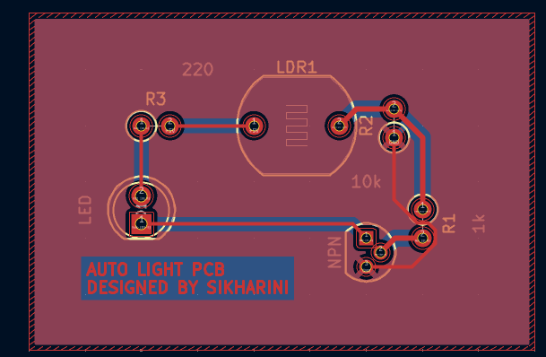
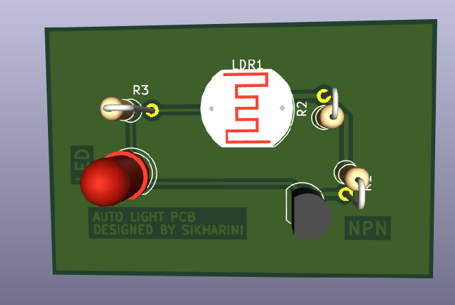

# Automatic-light-pcb
Automatic light PCB  using LDR designed in KiCad 
This project is a PCB design of an automatic light system using an LDR and an NPN transistor . The LED turns ON in darkness and OFF in bright light
TOOL USED
KiCAd

PCB LAYOUT

SCHEMATIC DIAGRAM

3D VIEW 

DESIGNED BY 
SIKHARINI S
